# Twilio Agent Framework Architecture

This document provides a comprehensive overview of the Twilio Agent Framework architecture, showing how all services work together to deliver a complete AI voice agent system.

## Architecture Diagram

```mermaid
graph TB
    %% External Systems
    subgraph "External Systems"
        TW[Twilio Platform]
        OAI[OpenAI API]
        PN[Pinecone Vector Store]
        SG[Segment Analytics]
        FLEX[Twilio Flex]
    end

    %% Client Layer
    subgraph "Client Layer"
        PHONE[Phone Calls]
        DASH[Web Dashboard]
        HUMAN[Human Agents]
    end

    %% Server Infrastructure
    subgraph "Server Infrastructure"
        SERVER[Express Server<br/>server.ts]
        FRAMEWORK[Agent Framework<br/>src/]
        
        subgraph "Core Services"
            EVENTBUS[Event Bus]
            SERVICEREG[Service Registry]
            CONFIG[Configuration]
            PLUGINS[Plugin System]
            LOGGER[Logger]
        end
    end

    %% Application Servers
    subgraph "Application Servers"
        COMPLETION[Completion Server<br/>completion-server/]
        INTEGRATION[Integration Server<br/>integration-server/]
        
        subgraph "Session Management"
            SESSIONSTORE[Session Store<br/>Twilio Sync]
            TURNSTORE[Turn Store]
            SYNCQUEUE[Sync Queue]
        end
    end

    %% Agent System
    subgraph "AI Agent System"
        RESOLVER[Agent Resolver]
        CONSCIOUS[OpenAI Conscious Loop]
        
        subgraph "Specialized Agents"
            PRIMARY[Primary Agent<br/>Conversation Handler]
            GOVERNANCE[Governance Agent<br/>Process Monitor]
            SUMMARY[Summarization Agent<br/>Call Summarizer]
        end
    end

    %% Communication Layer
    subgraph "Communication Layer"
        WEBSOCKET[WebSocket<br/>Conversation Relay]
        WEBHOOK[Webhook Handlers]
        TWIML[TwiML Generator]
    end

    %% Data & Context Services
    subgraph "Data & Context Services"
        VECTORSTORE[Vector Store Service]
        CONTEXTRET[Context Retriever]
        EMBEDDINGS[Embeddings Service]
        PROFILE[Profile Service]
    end

    %% Feature Modules
    subgraph "Feature Modules"
        FLEXMODULE[Flex Transfer Module]
        GOVMODULE[Governance Module]
        SUMMODULE[Summarization Module]
        HITL[Human-in-the-Loop Module]
    end

    %% UI Layer
    subgraph "UI Layer"
        NEXTJS[Next.js Dashboard<br/>ui/]
        COMPONENTS[React Components]
        STATE[State Management]
        SYNC[Sync Hooks]
    end

    %% Call Flow
    PHONE --> TW
    TW --> WEBHOOK
    WEBHOOK --> COMPLETION
    COMPLETION --> SESSIONSTORE
    COMPLETION --> WEBSOCKET
    WEBSOCKET --> RESOLVER
    RESOLVER --> CONSCIOUS
    CONSCIOUS --> PRIMARY

    %% Agent Communication
    PRIMARY --> EVENTBUS
    EVENTBUS --> GOVERNANCE
    EVENTBUS --> SUMMARY
    GOVERNANCE --> GOVMODULE
    SUMMARY --> SUMMODULE

    %% Framework Integration
    SERVER --> FRAMEWORK
    FRAMEWORK --> EVENTBUS
    FRAMEWORK --> SERVICEREG
    FRAMEWORK --> CONFIG
    FRAMEWORK --> PLUGINS
    FRAMEWORK --> LOGGER

    %% Data Flow
    CONSCIOUS --> OAI
    VECTORSTORE --> PN
    CONTEXTRET --> VECTORSTORE
    EMBEDDINGS --> OAI
    PROFILE --> SG
    COMPLETION --> VECTORSTORE
    SUMMARY --> VECTORSTORE

    %% Session Management
    SESSIONSTORE --> TW
    TURNSTORE --> SESSIONSTORE
    SYNCQUEUE --> SESSIONSTORE

    %% WebSocket & Real-time
    WEBSOCKET --> DASH
    SYNC --> WEBSOCKET
    STATE --> SYNC
    NEXTJS --> COMPONENTS
    COMPONENTS --> STATE

    %% Tool Integration
    PRIMARY --> FLEXMODULE
    FLEXMODULE --> FLEX
    HITL --> HUMAN
    GOVERNANCE --> LOGGER

    %% Response Flow
    CONSCIOUS --> WEBSOCKET
    WEBSOCKET --> TW
    TW --> PHONE

    %% Analytics & Monitoring
    COMPLETION --> SG
    GOVERNANCE --> SG
    SUMMARY --> SG

    %% Configuration Flow
    CONFIG --> COMPLETION
    CONFIG --> FRAMEWORK
    CONFIG --> VECTORSTORE

    %% Styling
    classDef external fill:#e1f5fe,stroke:#0288d1,stroke-width:2px
    classDef client fill:#f3e5f5,stroke:#7b1fa2,stroke-width:2px
    classDef server fill:#e8f5e8,stroke:#388e3c,stroke-width:2px
    classDef agent fill:#fff3e0,stroke:#f57c00,stroke-width:2px
    classDef data fill:#fce4ec,stroke:#c2185b,stroke-width:2px
    classDef ui fill:#e3f2fd,stroke:#1976d2,stroke-width:2px
    classDef module fill:#f1f8e9,stroke:#689f38,stroke-width:2px

    class TW,OAI,PN,SG,FLEX external
    class PHONE,DASH,HUMAN client
    class SERVER,FRAMEWORK,EVENTBUS,SERVICEREG,CONFIG,PLUGINS,LOGGER,COMPLETION,INTEGRATION,SESSIONSTORE,TURNSTORE,SYNCQUEUE server
    class RESOLVER,CONSCIOUS,PRIMARY,GOVERNANCE,SUMMARY agent
    class VECTORSTORE,CONTEXTRET,EMBEDDINGS,PROFILE,WEBSOCKET,WEBHOOK,TWIML data
    class NEXTJS,COMPONENTS,STATE,SYNC ui
    class FLEXMODULE,GOVMODULE,SUMMODULE,HITL module
```



## Key Components

### 🎯 Core Framework (`src/`)
- **Event Bus**: Central communication hub for inter-agent coordination
- **Service Registry**: Dependency injection and service lifecycle management
- **Configuration**: Hierarchical configuration with environment overrides
- **Plugin System**: Extensible architecture for agents and tools
- **Logger**: Structured logging throughout the system

### 📞 Voice Processing (`completion-server/`)
- **Completion Server**: Main orchestrator for voice conversations
- **Session Store**: Persistent conversation state via Twilio Sync
- **Turn Store**: Individual conversation turns and history
- **WebSocket Handler**: Real-time conversation relay management

### 🤖 AI Agent System
- **Primary Agent**: Main conversation handler with OpenAI integration
- **Governance Agent**: Process compliance and quality monitoring
- **Summarization Agent**: Real-time call summarization and topic extraction
- **Agent Resolver**: Routes and manages agent interactions

### 🎨 User Interface (`ui/`)
- **Next.js Dashboard**: Real-time conversation monitoring
- **React Components**: Modular UI components for call management
- **State Management**: Redux-like state for real-time updates
- **Sync Hooks**: WebSocket integration for live data

### 🧠 Data & Context Services
- **Vector Store**: Pinecone-based conversation history and semantic search
- **Context Retriever**: Intelligent context retrieval for personalization
- **Embeddings Service**: OpenAI embeddings for semantic understanding
- **Profile Service**: Segment integration for user analytics

### 🔧 Feature Modules
- **Flex Transfer**: Seamless handoff to human agents
- **Governance**: Process monitoring and compliance
- **Summarization**: Automated call summarization
- **Human-in-the-Loop**: Real-time collaboration features

## Data Flow Patterns

### 1. Voice Call Processing
```
Phone Call → Twilio → Webhook → Completion Server → Agent System → AI Response → TwiML → Twilio → Phone
```

### 2. Real-time Monitoring
```
WebSocket → UI Dashboard → State Management → React Components → User Interface
```

### 3. Context Enhancement
```
User Query → Vector Store → Pinecone → Context Retrieval → Agent Enhancement → Personalized Response
```

### 4. Agent Coordination
```
Primary Agent → Event Bus → Governance Agent → Process Monitoring → Quality Assurance
                         → Summary Agent → Call Summarization → Analytics
```

## External Integrations

- **Twilio Platform**: Voice calls, SMS, Conversation Relay, Flex
- **OpenAI API**: GPT models for conversation and embeddings
- **Pinecone**: Vector database for conversation history
- **Segment**: User analytics and profile management
- **Twilio Flex**: Human agent handoff capabilities

## Architecture Principles

1. **Event-Driven**: All components communicate via events for loose coupling
2. **Modular**: Plugin-based architecture for extensibility
3. **Real-time**: WebSocket connections for live monitoring and interaction
4. **Scalable**: Service registry and dependency injection for growth
5. **Observable**: Comprehensive logging and monitoring throughout
6. **Contextual**: Vector store integration for personalized interactions

This architecture enables a sophisticated AI voice agent system with real-time capabilities, conversation context management, and comprehensive monitoring while maintaining flexibility for future enhancements.