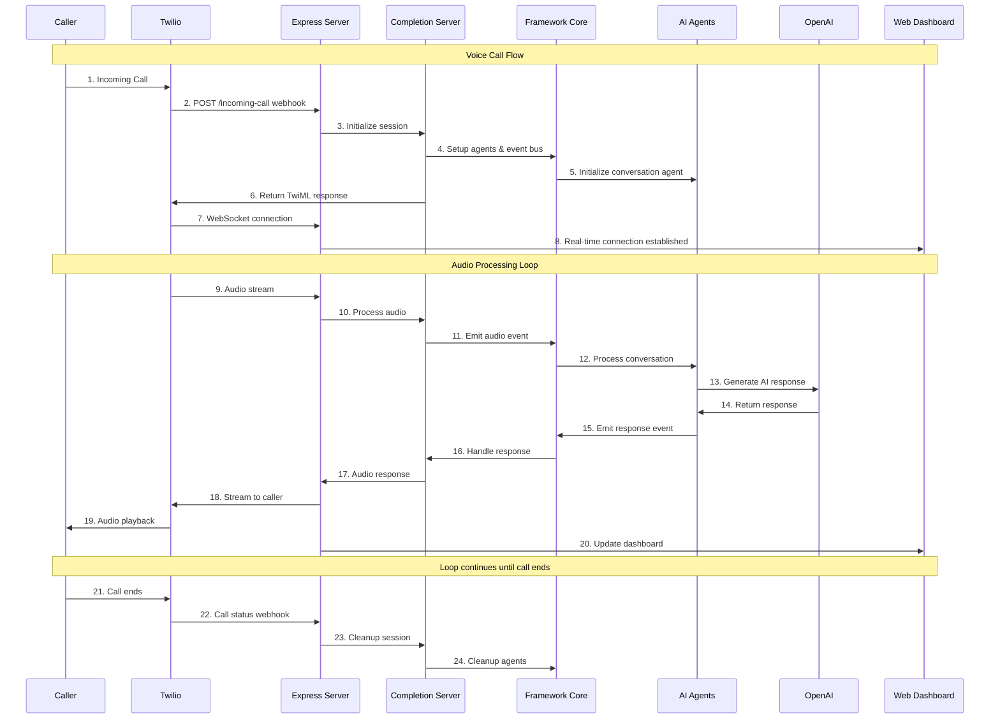
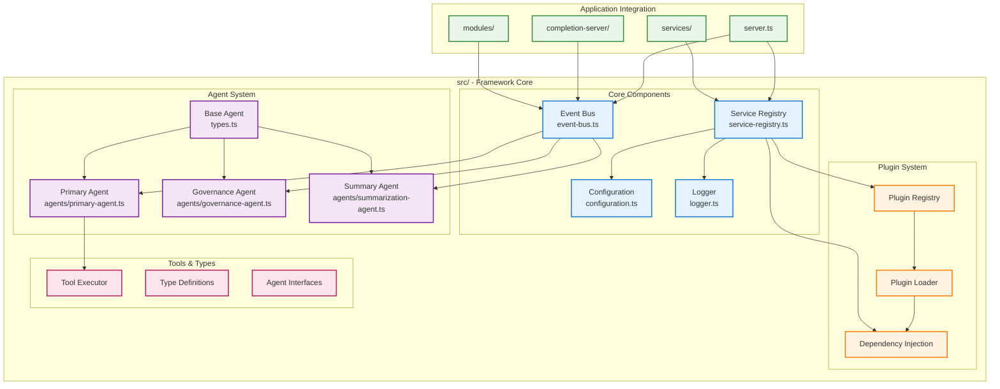

# Twilio Agent Framework

A complete, standalone AI voice agent system built on a modular event-driven framework. This system provides a production-ready voice assistant with Twilio integration, real-time conversation handling, and a comprehensive web UI.

## Features

### Core Framework
- **Event-Driven Architecture**: Agents communicate via a robust event bus system
- **Modular Design**: Plugin-based agent and tool system  
- **Configuration Management**: Hierarchical configuration with environment overrides
- **Service Registry**: Dependency injection and service lifecycle management
- **Comprehensive Testing**: Unit, integration, and E2E test suites
- **TypeScript First**: Full type safety and excellent developer experience

### Voice AI System
- **Twilio Integration**: Complete voice conversation handling via Conversation Relay
- **Real-time WebSocket**: Live conversation monitoring and control
- **Multi-Agent Coordination**: Primary conversation agent + governance/summarization subprocesses
- **Tool System**: Extensible function calling for external integrations
- **Vector Store**: Conversation history and semantic context retrieval (Pinecone)
- **User Analytics**: Segment integration for user profiling and tracking

### Production Features
- **Web UI**: Real-time conversation monitoring dashboard (Next.js)
- **Flex Integration**: Seamless handoff to human agents
- **Human-in-the-Loop**: Real-time collaboration between AI and human supervisors
- **Setup Scripts**: Automated Twilio service provisioning
- **Deployment**: Railway deployment configuration
- **Environment Management**: Comprehensive environment variable handling

## Quick Setup

### Prerequisites
- Node.js 18+
- OpenAI API key
- Twilio account (free trial works)

### 1. Environment Setup

```bash
# Copy environment template
cp .env.example .env

# Add your keys (minimum required)
HOSTNAME=your-domain.ngrok.app
OPENAI_API_KEY=your-openai-key
```

### 2. Install Dependencies

```bash
npm install
```

### 3. Setup Twilio Services

```bash
# This script provisions Twilio services and updates your .env
npm run setup
```

### 4. Start the System

```bash
# Start the voice agent backend
npm run dev

# In another terminal - start the web UI (optional)
npm run ui

# Start ngrok tunnel for webhooks
npm run grok
```

Your voice agent is now ready! Call the number shown in the terminal output.

## Development Workflow

### Starting Development
```bash
npm run dev         # Start backend server (auto-restart on changes)
npm run ui          # Start web UI dashboard  
npm run grok        # Start ngrok tunnel for webhooks
```

### Testing
```bash
npm test            # Run all tests
npm run test:unit   # Unit tests only
npm run test:e2e    # End-to-end tests
npm run demo        # Run framework demo
```

### Setup & Management
```bash
npm run setup               # Complete Twilio setup
npm run setup:phone         # Buy/configure phone number
npm run setup:flex          # Configure Flex workspace
npm run clear               # Clear session data
npm run deploy:railway      # Deploy to Railway
```

## Architecture Overview

### System Architecture

```mermaid
graph TB
    subgraph "External Services"
        Twilio[Twilio Voice API]
        OpenAI[OpenAI GPT-4]
        Pinecone[Pinecone Vector Store]
        Segment[Segment Analytics]
    end
    
    subgraph "Web UI"
        Dashboard[Next.js Dashboard]
        Monitor[Real-time Monitor]
        Control[Agent Control Panel]
    end
    
    subgraph "Express Server"
        HTTP[HTTP API Endpoints]
        WS[WebSocket Server]
        Bootstrap[Framework Bootstrap]
    end
    
    subgraph "Framework Core (src/)"
        EventBus[Event Bus]
        ServiceRegistry[Service Registry]
        Config[Configuration Manager]
        Logger[Structured Logger]
        PluginSystem[Plugin System]
    end
    
    subgraph "Completion Server"
        ConsciousLoop[Conscious Loop Agent]
        SessionStore[Session Store - Twilio Sync]
        TwilioHandlers[Twilio Webhook Handlers]
        AgentConfig[Agent Configuration]
        WSRelay[WebSocket Relay]
    end
    
    subgraph "Services"
        VectorStore[Vector Store Service]
        ContextRetrieval[Context Retrieval]
        UserAnalytics[User Analytics]
        EmbeddingSearch[Embedding Search]
    end
    
    subgraph "Feature Modules"
        FlexTransfer[Flex Transfer]
        Governance[Governance Agent]
        Summarization[Call Summarization]
        HumanInLoop[Human-in-the-Loop]
        AgentTools[Agent Tools]
    end
    
    subgraph "Agents (src/agents/)"
        PrimaryAgent[Primary Conversation Agent]
        GovernanceAgent[Governance Agent]
        SummaryAgent[Summarization Agent]
        BaseAgent[Base Agent Interface]
    end
    
    %% External connections
    Twilio --> HTTP
    HTTP --> WS
    WS --> Dashboard
    
    %% Server to Framework
    Bootstrap --> EventBus
    Bootstrap --> ServiceRegistry
    HTTP --> TwilioHandlers
    
    %% Framework connections
    EventBus --> PrimaryAgent
    EventBus --> GovernanceAgent
    EventBus --> SummaryAgent
    ServiceRegistry --> Config
    ServiceRegistry --> Logger
    ServiceRegistry --> PluginSystem
    
    %% Completion Server
    TwilioHandlers --> ConsciousLoop
    ConsciousLoop --> SessionStore
    TwilioHandlers --> WSRelay
    ConsciousLoop --> AgentConfig
    
    %% Services connections
    ConsciousLoop --> VectorStore
    VectorStore --> ContextRetrieval
    ContextRetrieval --> EmbeddingSearch
    ConsciousLoop --> UserAnalytics
    
    %% External service connections
    ConsciousLoop --> OpenAI
    VectorStore --> Pinecone
    UserAnalytics --> Segment
    
    %% Module connections
    ConsciousLoop --> FlexTransfer
    EventBus --> Governance
    EventBus --> Summarization
    WSRelay --> HumanInLoop
    PrimaryAgent --> AgentTools
    
    %% Styling
    classDef external fill:#e8f5e8,stroke:#388e3c,stroke-width:2px
    classDef ui fill:#f3e5f5,stroke:#7b1fa2,stroke-width:2px
    classDef server fill:#f8f9fa,stroke:#333,stroke-width:2px
    classDef framework fill:#e3f2fd,stroke:#1976d2,stroke-width:2px
    classDef completion fill:#fff3e0,stroke:#f57c00,stroke-width:2px
    classDef services fill:#fce4ec,stroke:#c2185b,stroke-width:2px
    classDef modules fill:#e0f2f1,stroke:#00796b,stroke-width:2px
    classDef agents fill:#f3e5f5,stroke:#7b1fa2,stroke-width:2px
    
    class Twilio,OpenAI,Pinecone,Segment external
    class Dashboard,Monitor,Control ui
    class HTTP,WS,Bootstrap server
    class EventBus,ServiceRegistry,Config,Logger,PluginSystem framework
    class ConsciousLoop,SessionStore,TwilioHandlers,AgentConfig,WSRelay completion
    class VectorStore,ContextRetrieval,UserAnalytics,EmbeddingSearch services
    class FlexTransfer,Governance,Summarization,HumanInLoop,AgentTools modules
    class PrimaryAgent,GovernanceAgent,SummaryAgent,BaseAgent agents
```



The system consists of multiple layers:
- **External Services**: Twilio Voice, OpenAI GPT, Pinecone vector store
- **Express Server**: Main HTTP API and WebSocket server
- **Framework Core**: Event-driven agent framework with service registry
- **Completion Server**: Twilio-specific voice conversation handling
- **Services**: Vector store, context retrieval, user analytics
- **Modules**: Feature modules for Flex, governance, summarization
- **Web UI**: Next.js dashboard for monitoring and control

### Call Flow



Voice conversations follow this sequence:
1. Caller dials Twilio number
2. Twilio webhooks to Express server
3. Server initializes session and agents
4. WebSocket connection established for real-time audio
5. Audio processed through conscious loop
6. AI agents generate responses via OpenAI
7. Responses streamed back to caller
8. Loop continues until call ends

### Framework Structure



The framework (`src/`) provides:
- **Core**: Event bus, service registry, configuration, logging
- **Agents**: AI agent implementations with event processing
- **Plugin System**: Dynamic loading with dependency injection
- **Tools & Types**: Function execution and TypeScript definitions
- **Integration**: Bootstrap and lifecycle management

### Directory Structure
```
├── server.ts                 # Express server + framework initialization
├── completion-server/        # Conversation handling & Twilio integration
│   ├── conscious-loop/       # Primary OpenAI conversation agent
│   ├── session-store/        # State management via Twilio Sync
│   └── twilio/              # Voice webhook handlers
├── integration-server/       # Mock database & external APIs
├── modules/                  # Feature modules (Flex, governance, etc.)
├── services/                 # Vector store, context retrieval
├── src/                     # Framework core implementation
│   ├── agents/              # AI agent implementations
│   ├── event-bus.ts         # Inter-agent communication
│   ├── service-registry.ts  # Dependency injection
│   ├── configuration.ts     # Config management
│   └── logger.ts           # Structured logging
└── ui/                      # Next.js web dashboard
```

## Configuration

### Environment Variables

**Required for basic functionality:**
```bash
HOSTNAME=your-domain.ngrok.app
OPENAI_API_KEY=your-openai-key
TWILIO_ACCOUNT_SID=your-account-sid
TWILIO_API_KEY=your-api-key
TWILIO_API_SECRET=your-api-secret
TWILIO_SYNC_SVC_SID=your-sync-service-sid
```

**Optional for advanced features:**
```bash
# Vector store for conversation history
PINECONE_API_KEY=your-pinecone-key
PINECONE_INDEX_NAME=your-index-name

# User analytics and tracking
SEGMENT_PROFILE_API_TOKEN=your-segment-token
SEGMENT_TRACKING_WRITE_KEY=your-segment-key
SEGMENT_WORKSPACE_ID=your-workspace-id
SEGMENT_SPACE_ID=your-space-id

# Flex for human handoff
FLEX_WORKFLOW_SID=your-workflow-sid
FLEX_WORKSPACE_SID=your-workspace-sid
```

### Framework Configuration
Configuration files in `config/`:
- `defaults.json` - Base configuration
- `development.json` - Development overrides  
- `production.json` - Production settings

## Customization

### Adding Custom Tools
```typescript
// agent/tools/custom-tools.ts
export const myCustomTool: ToolExecutor<MyToolArgs> = async (args, deps) => {
  // Your tool implementation
  return { success: true, data: "result" };
};

// agent/tools/index.ts
import { myCustomTool } from './custom-tools.js';

export const toolManifest = [
  ...commonToolManifest,
  {
    name: "myCustomTool",
    description: "Description of what this tool does",
    // ... OpenAI function definition
  }
];
```

### Creating Custom Agents
```typescript
// src/agents/my-agent.ts
import { BaseAgent } from '../types.js';

export class MyCustomAgent extends BaseAgent {
  async processEvent(event: AgentEvent): Promise<void> {
    // Your agent logic
  }
}
```

### Extending the UI
The UI is a standard Next.js application in the `ui/` directory. Add custom components in `ui/components/` and pages in `ui/pages/`.

## API Reference

### Framework Core
```typescript
// Create and start framework
const framework = await createFramework({
  configDir: './config',
  environment: 'development'
});
await framework.start();

// Access services
const eventBus = framework.getService('eventBus');
const config = framework.getService('config');
const logger = framework.getService('logger');
```

### Voice Conversation Endpoints
- `POST /incoming-call` - Twilio voice webhook
- `POST /call-status` - Call status updates
- `POST /outbound` - Initiate outbound calls
- `WS /convo-relay/:callSid` - Real-time conversation WebSocket

### Management Endpoints
- `GET /sync-token` - Generate Sync access tokens
- `POST /wrapup-call` - Handle call completion

## Deployment

### Railway (Recommended)
```bash
npm run deploy:railway
```

### Manual Deployment
1. Set environment variables on your platform
2. Run `npm run build` 
3. Start with `npm start`
4. Configure webhooks to point to your domain

## Examples

See the `examples/` directory for:
- Basic framework usage
- Custom agent creation
- Twilio integration patterns
- Tool development examples

## Testing

Run the complete test suite:
```bash
npm test                # All tests
npm run test:unit       # Unit tests only  
npm run test:integration # Integration tests
npm run test:e2e        # End-to-end tests
npm run test:coverage   # With coverage report
```

## Contributing

1. Fork the repository
2. Create a feature branch
3. Make your changes
4. Add tests for new functionality
5. Ensure all tests pass
6. Submit a pull request

## License

MIT License - see LICENSE file for details.

## Support

- Check the `docs/` directory for additional guides
- Review `examples/` for implementation patterns  
- Open an issue for bugs or feature requests

---

**Ready to build? Start with `npm run setup` and begin creating your AI voice agent!**