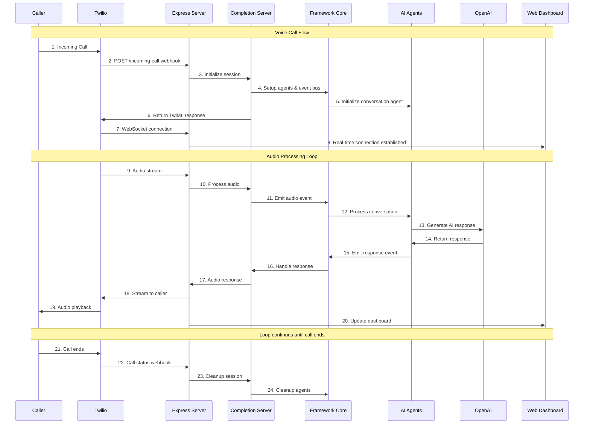
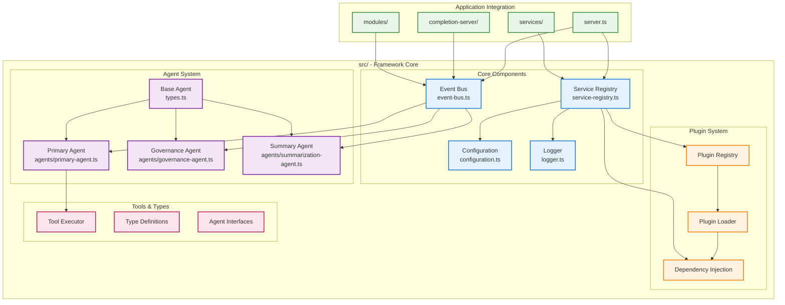

# System Architecture - Mermaid Diagrams

## System Architecture

```mermaid
graph TB
    subgraph "External Services"
        Twilio[Twilio Voice API]
        OpenAI[OpenAI GPT-4]
        Pinecone[Pinecone Vector Store]
        Segment[Segment Analytics]
    end
    
    subgraph "Web UI"
        Dashboard[Next.js Dashboard]
        Monitor[Real-time Monitor]
        Control[Agent Control Panel]
    end
    
    subgraph "Express Server"
        HTTP[HTTP API Endpoints]
        WS[WebSocket Server]
        Bootstrap[Framework Bootstrap]
    end
    
    subgraph "Framework Core (src/)"
        EventBus[Event Bus]
        ServiceRegistry[Service Registry]
        Config[Configuration Manager]
        Logger[Structured Logger]
        PluginSystem[Plugin System]
    end
    
    subgraph "Completion Server"
        ConsciousLoop[Conscious Loop Agent]
        SessionStore[Session Store - Twilio Sync]
        TwilioHandlers[Twilio Webhook Handlers]
        AgentConfig[Agent Configuration]
        WSRelay[WebSocket Relay]
    end
    
    subgraph "Services"
        VectorStore[Vector Store Service]
        ContextRetrieval[Context Retrieval]
        UserAnalytics[User Analytics]
        EmbeddingSearch[Embedding Search]
    end
    
    subgraph "Feature Modules"
        FlexTransfer[Flex Transfer]
        Governance[Governance Agent]
        Summarization[Call Summarization]
        HumanInLoop[Human-in-the-Loop]
        AgentTools[Agent Tools]
    end
    
    subgraph "Agents (src/agents/)"
        PrimaryAgent[Primary Conversation Agent]
        GovernanceAgent[Governance Agent]
        SummaryAgent[Summarization Agent]
        BaseAgent[Base Agent Interface]
    end
    
    %% External connections
    Twilio --> HTTP
    HTTP --> WS
    WS --> Dashboard
    
    %% Server to Framework
    Bootstrap --> EventBus
    Bootstrap --> ServiceRegistry
    HTTP --> TwilioHandlers
    
    %% Framework connections
    EventBus --> PrimaryAgent
    EventBus --> GovernanceAgent
    EventBus --> SummaryAgent
    ServiceRegistry --> Config
    ServiceRegistry --> Logger
    ServiceRegistry --> PluginSystem
    
    %% Completion Server
    TwilioHandlers --> ConsciousLoop
    ConsciousLoop --> SessionStore
    TwilioHandlers --> WSRelay
    ConsciousLoop --> AgentConfig
    
    %% Services connections
    ConsciousLoop --> VectorStore
    VectorStore --> ContextRetrieval
    ContextRetrieval --> EmbeddingSearch
    ConsciousLoop --> UserAnalytics
    
    %% External service connections
    ConsciousLoop --> OpenAI
    VectorStore --> Pinecone
    UserAnalytics --> Segment
    
    %% Module connections
    ConsciousLoop --> FlexTransfer
    EventBus --> Governance
    EventBus --> Summarization
    WSRelay --> HumanInLoop
    PrimaryAgent --> AgentTools
    
    %% Styling
    classDef external fill:#e8f5e8,stroke:#388e3c,stroke-width:2px
    classDef ui fill:#f3e5f5,stroke:#7b1fa2,stroke-width:2px
    classDef server fill:#f8f9fa,stroke:#333,stroke-width:2px
    classDef framework fill:#e3f2fd,stroke:#1976d2,stroke-width:2px
    classDef completion fill:#fff3e0,stroke:#f57c00,stroke-width:2px
    classDef services fill:#fce4ec,stroke:#c2185b,stroke-width:2px
    classDef modules fill:#e0f2f1,stroke:#00796b,stroke-width:2px
    classDef agents fill:#f3e5f5,stroke:#7b1fa2,stroke-width:2px
    
    class Twilio,OpenAI,Pinecone,Segment external
    class Dashboard,Monitor,Control ui
    class HTTP,WS,Bootstrap server
    class EventBus,ServiceRegistry,Config,Logger,PluginSystem framework
    class ConsciousLoop,SessionStore,TwilioHandlers,AgentConfig,WSRelay completion
    class VectorStore,ContextRetrieval,UserAnalytics,EmbeddingSearch services
    class FlexTransfer,Governance,Summarization,HumanInLoop,AgentTools modules
    class PrimaryAgent,GovernanceAgent,SummaryAgent,BaseAgent agents
```

## Call Flow Sequence

```mermaid
sequenceDiagram
    participant Caller
    participant Twilio
    participant Server as Express Server
    participant Completion as Completion Server
    participant Framework as Framework Core
    participant Agents as AI Agents
    participant OpenAI
    participant UI as Web Dashboard
    
    Note over Caller,UI: Voice Call Flow
    
    Caller->>Twilio: 1. Incoming Call
    Twilio->>Server: 2. POST /incoming-call webhook
    Server->>Completion: 3. Initialize session
    Completion->>Framework: 4. Setup agents & event bus
    Framework->>Agents: 5. Initialize conversation agent
    
    Completion->>Twilio: 6. Return TwiML response
    Twilio->>Server: 7. WebSocket connection
    Server->>UI: 8. Real-time connection established
    
    Note over Caller,UI: Audio Processing Loop
    
    Twilio->>Server: 9. Audio stream
    Server->>Completion: 10. Process audio
    Completion->>Framework: 11. Emit audio event
    Framework->>Agents: 12. Process conversation
    
    Agents->>OpenAI: 13. Generate AI response
    OpenAI->>Agents: 14. Return response
    Agents->>Framework: 15. Emit response event
    Framework->>Completion: 16. Handle response
    
    Completion->>Server: 17. Audio response
    Server->>Twilio: 18. Stream to caller
    Twilio->>Caller: 19. Audio playback
    
    Server->>UI: 20. Update dashboard
    
    Note over Caller,UI: Loop continues until call ends
    
    Caller->>Twilio: 21. Call ends
    Twilio->>Server: 22. Call status webhook
    Server->>Completion: 23. Cleanup session
    Completion->>Framework: 24. Cleanup agents
```

## Framework Structure

```mermaid
graph TB
    subgraph "src/ - Framework Core"
        subgraph "Core Components"
            EventBus[Event Bus<br/>event-bus.ts]
            ServiceRegistry[Service Registry<br/>service-registry.ts]
            Config[Configuration<br/>configuration.ts]
            Logger[Logger<br/>logger.ts]
        end
        
        subgraph "Agent System"
            BaseAgent[Base Agent<br/>types.ts]
            PrimaryAgent[Primary Agent<br/>agents/primary-agent.ts]
            GovernanceAgent[Governance Agent<br/>agents/governance-agent.ts]
            SummaryAgent[Summary Agent<br/>agents/summarization-agent.ts]
        end
        
        subgraph "Plugin System"
            PluginRegistry[Plugin Registry]
            PluginLoader[Plugin Loader]
            DependencyInjection[Dependency Injection]
        end
        
        subgraph "Tools & Types"
            ToolExecutor[Tool Executor]
            TypeDefinitions[Type Definitions]
            Interfaces[Agent Interfaces]
        end
    end
    
    subgraph "Application Integration"
        ServerBootstrap[server.ts]
        CompletionServer[completion-server/]
        Modules[modules/]
        Services[services/]
    end
    
    %% Core relationships
    EventBus --> PrimaryAgent
    EventBus --> GovernanceAgent
    EventBus --> SummaryAgent
    ServiceRegistry --> Config
    ServiceRegistry --> Logger
    ServiceRegistry --> PluginRegistry
    
    %% Agent relationships
    BaseAgent --> PrimaryAgent
    BaseAgent --> GovernanceAgent
    BaseAgent --> SummaryAgent
    PrimaryAgent --> ToolExecutor
    
    %% Plugin relationships
    PluginRegistry --> PluginLoader
    PluginLoader --> DependencyInjection
    ServiceRegistry --> DependencyInjection
    
    %% Integration
    ServerBootstrap --> EventBus
    ServerBootstrap --> ServiceRegistry
    CompletionServer --> EventBus
    Modules --> EventBus
    Services --> ServiceRegistry
    
    %% Styling
    classDef core fill:#e3f2fd,stroke:#1976d2,stroke-width:2px
    classDef agents fill:#f3e5f5,stroke:#7b1fa2,stroke-width:2px
    classDef plugins fill:#fff3e0,stroke:#f57c00,stroke-width:2px
    classDef tools fill:#fce4ec,stroke:#c2185b,stroke-width:2px
    classDef integration fill:#e8f5e8,stroke:#388e3c,stroke-width:2px
    
    class EventBus,ServiceRegistry,Config,Logger core
    class BaseAgent,PrimaryAgent,GovernanceAgent,SummaryAgent agents
    class PluginRegistry,PluginLoader,DependencyInjection plugins
    class ToolExecutor,TypeDefinitions,Interfaces tools
    class ServerBootstrap,CompletionServer,Modules,Services integration
```